# fifa-finder-application
A project which combines all aspects of fundamental training in QA.

This project will involve concepts from all core training modules; more
specifically, this will involve:

* Project Management
* C# Fundamentals
* Unit Testing
* Git
* Basic Linux
* Angular Web Development
* Continuous Integration
* Cloud Fundamentals
* Databases

## The Idea ##
The idea for this application is simple; it is a medium for players of the popular video game 'Fifa' to connect and partner up. The video game provides little support for players not already on eachothers console friend list to play together, this web application will provide this service, it will boast a fully functioning backend design which allows users to upload posts with looking for gaming partners. This application will have full CRUD functionality (Create,Read,Update,Delete).

## Requirements ##
The conception of this project involved setting up a clear structure of requirements. I undertook MoSCoW prioritisation techniques to get started; this a common requirements management strategy for agile based development projects. I looked at project requirements under 4 scopes: **Must Have, Should Have, Could Have and Won't Have;** listed in descending order of priority.
#### MoSCoW Requirements Diagram ####
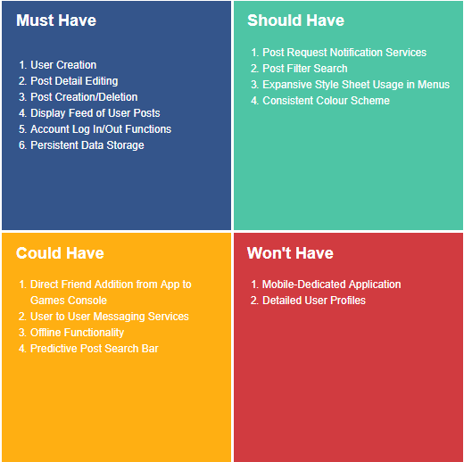

In the four quadrants above, each represents one the prioritisation categories, the **Must Have** section is the most important because it represents requirements which must be met in order to obtain a minimum viable product. The next step is representing the project requirements in a more development-digestible format using a **Kanban board**; the requirements will be broken down through **Epics, Stories and Tasks.**
## Analysis ##
The next phase of the project requires stringent risk analysis to decide on protocols in typical scenarios that may arise during the development life cycle. I created a **Risk Assessment Matrix** to represent and evaluate risks involved in the project going forward. These risks are assessed under the following headings: **Evaluation, Likelihood, Impact, Responsibility, Response and Control Measure.**
### Risk Assessment ###
These risks were formulated based on the tachnology stack required for the project and analysing what could go wrong in their interactions, there is a clear pattern of how these risks arise and what the approach to them will be.
#### Risk Assessment Matrix ####
|   Risk          | Evaluation | Likelihood| Impact  | Responsibility   |Response   | Control Measure  |
|:-------|:------|:---    |:---    |:-------|:------|:-----  |
| Application's virtual machine goes down | Application goes offline| Low | High | Cloud Service Provider  | Recreate infrastruture on another machine |  Use infrastructure as code to quickly recreate machine  |
| Broken version deployed onto production   | Application may not have all required features functional  |   Medium    | High | Developer     | Revert production to latest stable verion  | Automate tests before production push and restrict access to production branch      |
| DDOS attack    | Server goes down |    Medium    | High | Microsoft | Recreate infrastruture on another machine  |  Use infrastructure as code to quickly recreate machine   |
| High traffic    | Server requests could be unreliable/unavailable   |  Medium  | High| Developer  | Buy more azure server network allocation  | Ensure services are elastic|
| Data breach    | Customer data compromised   |   Medium    | Medium | Developer  | Notify relevant parties | Revise project access hierarchy and advise on latest security practices|
| Regional power outage     | Application goes offline   |    Low    | High | Cloud Service Provider  | Recreate infrsatructure in another region  | Set up standby server in another region |
| Not delivering requirements on schedule    | Application wont meet minimum viable prodcut scope  |    Medium    | High | Developer  | Ammend scheduled project delivery time   | Stick to minimum viable product scope as a first priority |

### User Stories ###
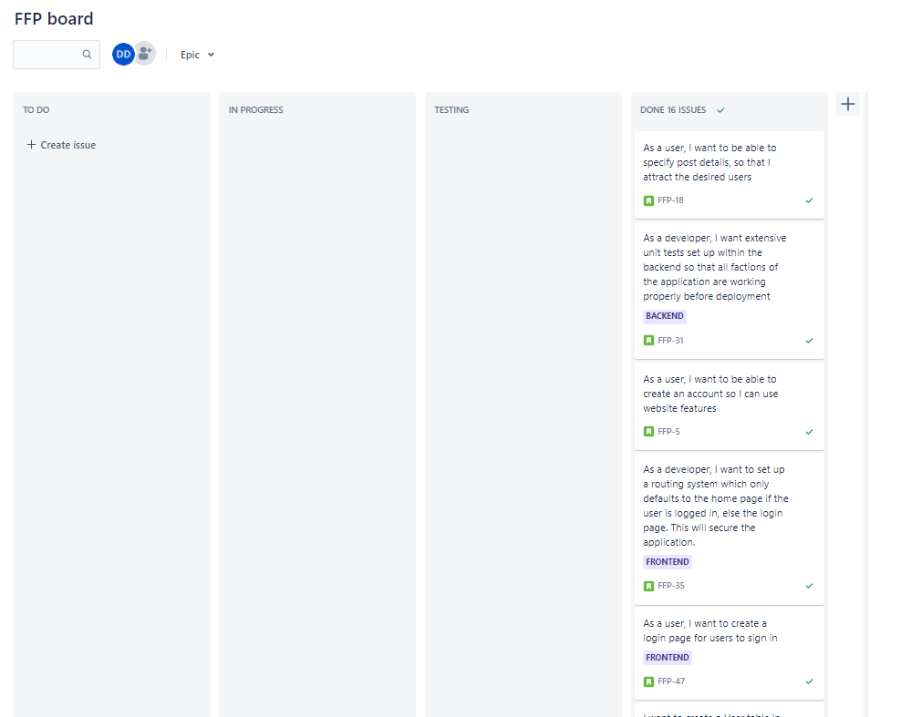
Using Jira, the project requirements were tracked continuosly using a kanban board which can be seen [here](https://darrendoyle.atlassian.net/jira/software/projects/FFP/boards/3 "Named link title"). The project tracking process was very simple and revolved around user stories which could either be frontend or backend related. A user story will usually outline a job that needs to be done from a developer or user perspective. I put all user stories on the backlog and when it was time to use them, I would put them on the kanban board. The kanban board has four simple stages: To Do, In Progress, Testing, Done. To Do means the story is yet to be taken up or worked on yet, this may be because of dependecy on another user story. In Progress means the story is being worked on currently. Testing means the completed story is neing analysed for any bugs, if it passes it moves to Done.

## Design ##
### Technologies Used ###
* Kanban Board: Jira
* Database: Azure Virtual Machine
* Programming languages: C# & Javascript
* Front-end: Angular
* Version Control: Git
* CI Server: Azure DevOps
* Cloud server: Azure App Service
### Database Structure ###
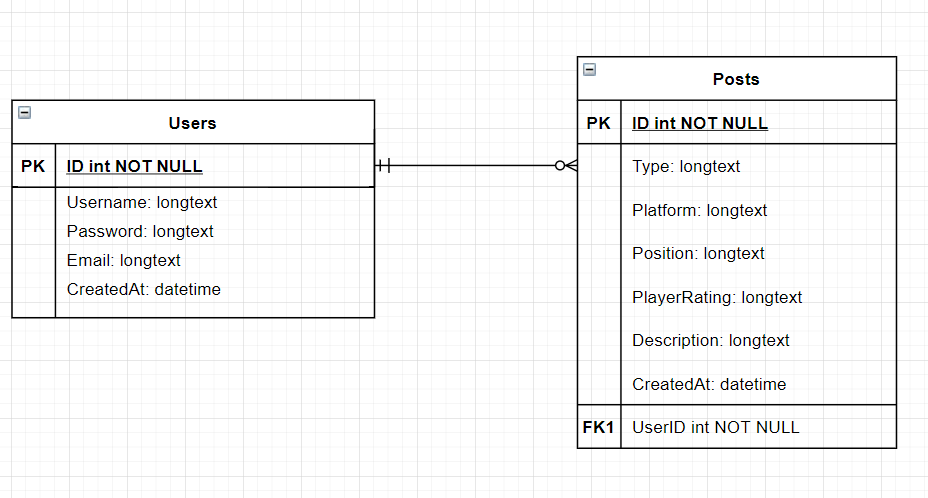
There are two database tables which are Users and Posts. Users is the entity which represents a user on the system, they have a user account which permits them to create Posts. This relationship between the tables is a **One and Only One To Zero Or Many**, a user can none or many posts, while a post only belongs to a single User record if it exists. This establishes a UserID foreign key in the Posts table which establishes the link. Users will be able to use CRUD functionality on the post table through the applciation built on this database.

## Frontend ##
The frontend was designed using an Angular framework form javascript, this was stretch goal which was I felt was necessary to consolidate my learning. In the frontend I tried to showcase as much as I learned in training with the Ng module, Component-Orientated project structure, Directives and Observables.
### Login Portal ###
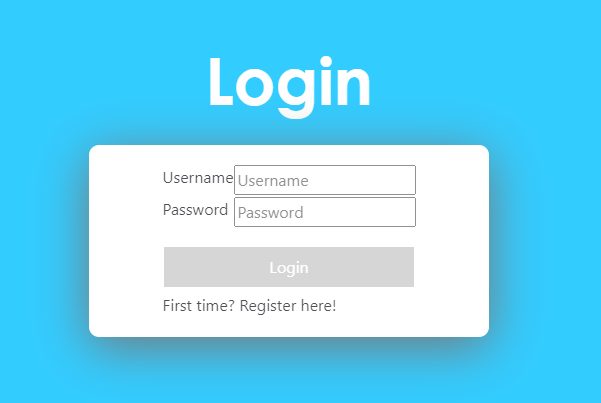
A user that visits the webpage for the first time will have to login first, the application structure has an auth service which checks to see if there is a current user, else the application content is off limits. This works in addition to browser storage to allow already logged in users to enter the website easily the second time they visit. The login portal itself is basic; it in corporates the powerful Angular Ng module with conditional rendering for the login and registration pages. The functionality of this page will be detailed in the backend. 
### Post Page ###
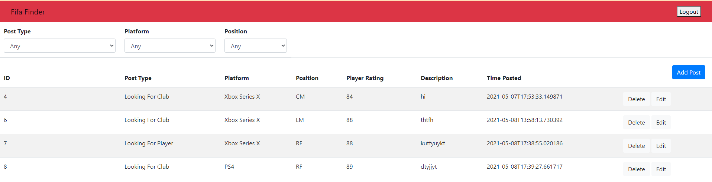
This is the hub of the application, the user interface shows a post table, showing the latest posts by users on the system. The data is realtime from the MYSQL database from an azure VM and loads on initialization of the post component. The posts are displayed using a list and the NgFor module, which populates until the lost is empty. Each row of the table contains an edit and delete button; the delete button fucntions for that specific post on a simple click. The edit button allows for an update of a current record, these operations are reflected in the database. 

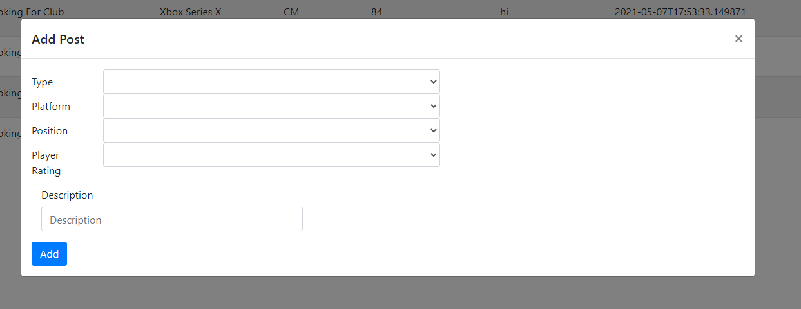
There is an add button at the top of the table which allows a user to fill in a form of their requirements and post to the database. 

There are three drop down option selectors above the table which allows a user to filter posts based on preferences in post type, platform and position. These filters operate off a copy of the main post list, when and option is selected it calls a corresponding method which will remove the irrelevant posts, and additionally they can be used together for the ultimate refinement from a user perspective. The user can also log out from the application from the main page, in doing so they are redirected to the login screen with local storage being deleted. 

## Backend ## 
The backend was designed in ASP.Net Core, and was implemented as an API application which could be called from the frontend. This means it is acting as the middle-man between user experience and the relational MYSQL database. This API would have controllers for the Post and User table, handling the CRUD operations and returning JSON value to via HTTP requests. 
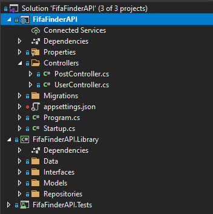
### Database ###
The database of choice was MYSQL, whihc is hosted on an Azure Virtual Machine. To hook this up to the applicaton we needed a connection string and appropriate Data models to represent the tables with in the database. 
### User Controller ###
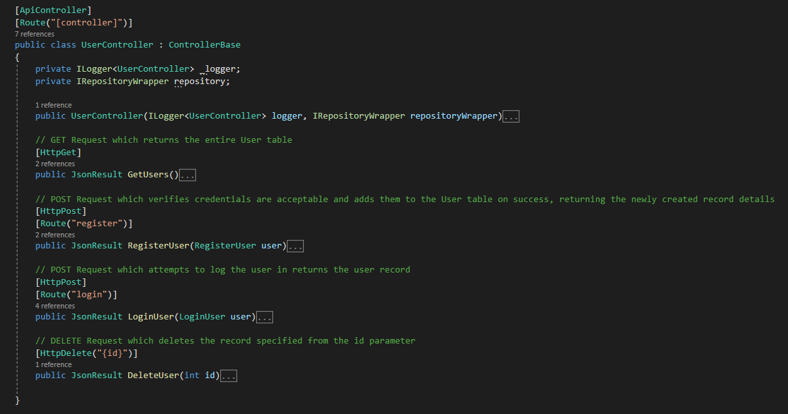
The user controller is handling all operations related to the user table, there are methods written which return a JSON object. The methods written use Database Context in order to directly query the database and write logic in order to fulfil user requests. This includes a login, deletion and registration method.
### Post Controller ###
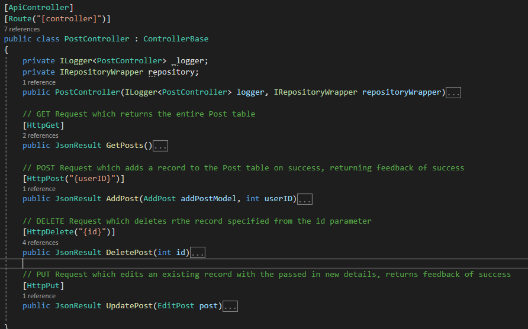
The post controller works similarly, providing add,delete and update methods which are returned to the frontend.
## Testing ##
Extensive Unit testing was conducted on both controllers, ensuring operations were not returning incorrect types or null values. The controllers followed repository pattern best practices in order to provide a layer of encapsulation to the database. Code coverage was extensive on both controllers, I did not have view models in my project which might bring my percentage of coverage down (based on the coverage.json file).
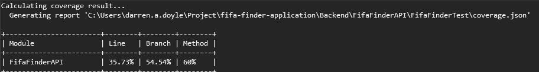
## CI/CD Pipeline & Deployment ##
The application was deployed with Azure DevOps using Azure pipelines. This set up allows for continuous deployment and integration of application builds while staying live in deployment. The application itself is being hosted on azure app service, with a virtual machine acting as a build agent. Below we can see the successful pipleline build of the application and subequent deployment to the app server.
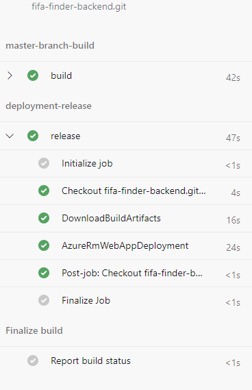
## What To Improve ## 
* The repository pattern was implemented too late and made project timing difficult, this had a knock on effect to other areas of the application.
* Based on the last step, there were issues parsing the user object back to the frontend, despite my best efforts using a data bind model to return the user ID for posts.
* Issues with deployment of the separate applications.

