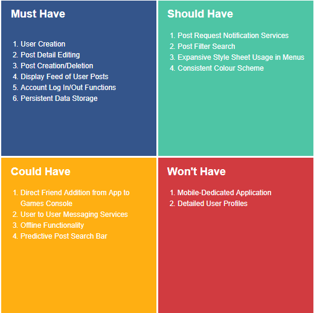

# fifa-finder-application
A project which combines all aspects of fundamental training in QA.

This project will involve concepts from all core training modules; more
specifically, this will involve:

* Project Management
* C# Fundamentals
* Unit Testing
* Git
* Basic Linux
* Angular Web Development
* Continuous Integration
* Cloud Fundamentals
* Databases

## The Idea ##
The idea for this application is simple; it is a medium for players of the popular video game 'Fifa' to connect and partner up. The video game provides little support for players not already on eachothers console friend list to play together, this web application will provide this service, it will boast a fully functioning backend design which allows users to upload posts with looking for gaming partners. This application will have full CRUD functionality (Create,Read,Update,Delete).

## Requirements ##
The conception of this project involved setting up a clear structure of requirements. I undertook MoSCoW prioritisation techniques to get started; this a common requirements management strategy for agile based development projects. I looked at project requirements under 4 scopes: **Must Have, Should Have, Could Have and Won't Have;** listed in descending order of priority.
#### MoSCoW Requirements Diagram ####

In the four quadrants above, each represents one the prioritisation categories, the **Must Have** section is the most important because it represents requirements which must be met in order to obtain a minimum viable product. The next step is representing the project requirements in a more development-digestible format using a **Kanban board**; the requirements will be broken down through **Epics, Stories and Tasks.**
## Analysis ##
The next phase of the project requires stringent risk analysis to decide on protocols in typical scenarios that may arise during the development life cycle. I created a **Risk Assessment Matrix** to represent and evaluate risks involved in the project going forward. These risks are assessed under the following headings: **Evaluation, Likelihood, Impact, Responsibility, Response and Control Measure.**

#### Risk Assessment Matrix ####
|   Risk          | Evaluation | Likelihood| Impact  | Responsibility   |Response   | Control Measure  |
|:-------|:------|:---    |:---    |:-------|:------|:-----  |
| Application's virtual machine goes down | Application goes offline| Low | High | Cloud Service Provider  | Recreate infrastruture on another machine |  Use infrastructure as code to quickly recreate machine  |
| Broken version deployed onto production   | Application may not have all required features functional  |   Medium    | High | Developer     | Revert production to latest stable verion  | Automate tests before production push and restrict access to production branch      |
| DDOS attack    | Server goes down |    Medium    | High | Microsoft | Recreate infrastruture on another machine  |  Use infrastructure as code to quickly recreate machine   |
| High traffic    | Server requests could be unreliable/unavailable   |  Medium  | High| Developer  | Buy more azure server network allocation  | Ensure services are elastic|
| Data breach    | Customer data compromised   |   Medium    | Medium | Developer  | Notify relevant parties | Revise project access hierarchy and advise on latest security practices|
| Regional power outage     | Application goes offline   |    Low    | High | Cloud Service Provider  | Recreate infrsatructure in another region  | Set up standby server in another region |
| Not delivering requirements on schedule    | Application wont meet minimum viable prodcut scope  |    Medium    | High | Developer  | Ammend scheduled project delivery time   | Stick to minimum viable product scope as a first priority |

### User Stories ###
tidy jira and screenshot + link

## Design ##
### Technologies Used ###
### Database Structure ###

## Frontend ##
pics of frontend and explaining it
## Backend ## 
pics of controllers explaining
## Testing ##
pics of tests and coverage
## What To Improve ## 
mention testing repo pattern
not being able to parse user object to front end

